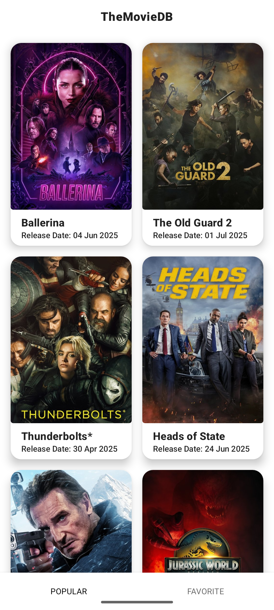
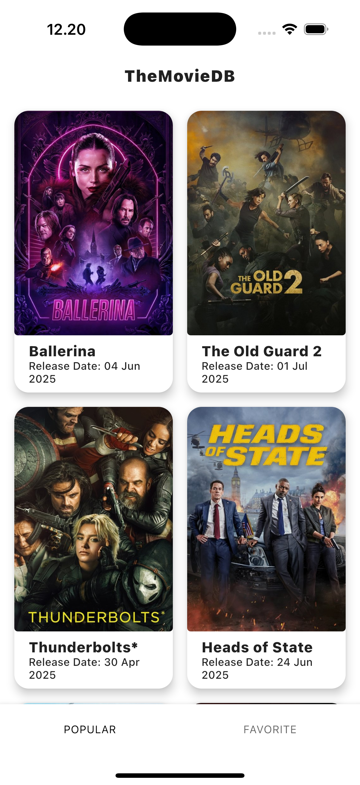
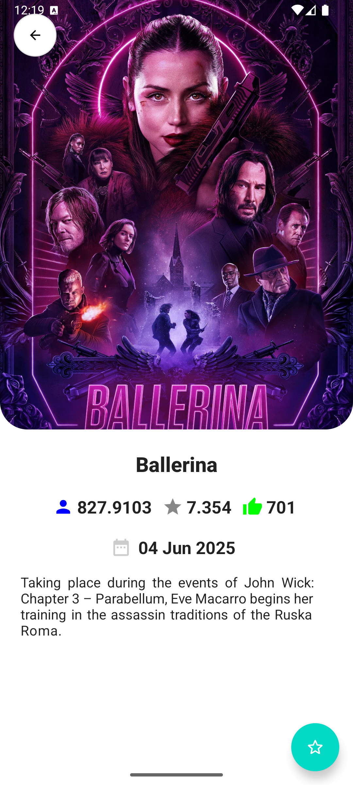
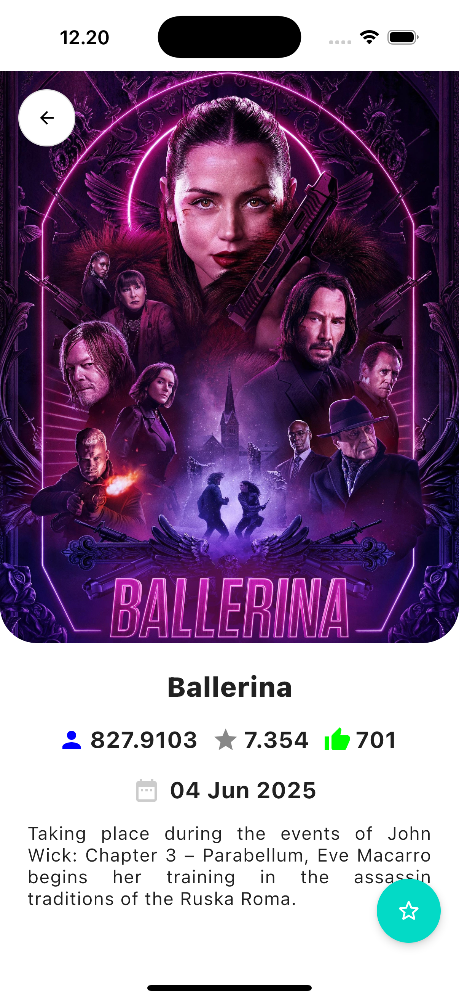

# 🎬 TheMovieDB

A cross-platform movie discovery app built with **Compose Multiplatform** that runs natively on both Android and iOS platforms using The Movie Database (TMDb) API.

## ✨ Features

- 🎯 **Cross-Platform**: Single codebase for Android and iOS
- 🎨 **Modern UI**: Built with Jetpack Compose and Material Design
- 📄 **Pagination**: Efficient loading of large movie lists
- 💾 **Offline Support**: Local caching with Realm Database for favorite movies

## 📱 Screenshots

| Android | iOS |
|---------|-----|
|  |  |
|  |  |

## 🛠️ Tech Stack

### Core Framework
- **[Compose Multiplatform](https://github.com/JetBrains/compose-multiplatform)** - Shared UI framework for Android and iOS
- **[Kotlin Multiplatform](https://kotlinlang.org/docs/multiplatform.html)** - Cross-platform development

### UI & Design
- **[Jetpack Compose](https://developer.android.com/jetpack/compose)** - Modern UI toolkit
- **[Material Design](https://material.io/develop/android/docs/getting-started)** - Google's design system
- **[PreCompose](https://github.com/Tlaster/PreCompose)** - Navigation and lifecycle management
- **[ImageLoader](https://github.com/qdsfdhvh/compose-imageloader)** - Image loading and caching

### Architecture & Patterns
- **[MVI (Model-View-Intent)](https://hannesdorfmann.com/android/model-view-intent/)** - Unidirectional data flow
- **[Clean Architecture](https://blog.cleancoder.com/uncle-bob/2012/08/13/the-clean-architecture.html)** - Separation of concerns
- **[Repository Pattern](https://developer.android.com/jetpack/guide/data-layer)** - Data abstraction layer

### Networking & Data
- **[Ktor](https://ktor.io/)** - HTTP client for API calls
- **[Realm Database](https://realm.io/realm-kotlin/)** - Local database for offline support
- **[Paging AndroidX](https://developer.android.com/topic/libraries/architecture/paging/v3-overview)** - Android pagination
- **[Paging CashApp](https://github.com/cashapp/paging)** - Multiplatform pagination

### Concurrency & Configuration
- **[Coroutines](https://kotlinlang.org/docs/coroutines-overview.html)** - Asynchronous programming
- **[BuildKonfig](https://github.com/yshrsmz/BuildKonfig)** - Configuration management

## 📋 Requirements

### Android
- Android 7.0 (API level 24) or higher
- Android Studio Arctic Fox or later

### iOS
- iOS 14.0 or later
- Xcode 14.0 or later
- macOS 12.0 or later

## 🚀 Getting Started

### Prerequisites
1. Install [Android Studio](https://developer.android.com/studio)
2. Install [Xcode](https://developer.apple.com/xcode/) (for iOS development)
3. Install [Kotlin Multiplatform Mobile plugin](https://plugins.jetbrains.com/plugin/14936-kotlin-multiplatform-mobile)

### Setup
1. **Clone the repository**
   ```bash
   git clone https://github.com/mahesaiqbal/TheMovieDB.git
   cd TheMovieDB
   ```

2. **Get your API key from TMDb**
   - Visit [The Movie Database (TMDb)](https://www.themoviedb.org/settings/api)
   - Create an account and request an API key
   - Create a `local.properties` file in the root directory
   - Add your API key and another information:
     ```properties
     TMDB_API_KEY=your_api_key_here
     TMDB_BASE_URL=https://api.themoviedb.org/3/
     TMDB_APP_NAME=TheMovieDB
     ```

## 🏗️ Project Structure

```
TheMovieDB/
├── composeApp/                    # Main application module
│   ├── src/
│   │   ├── commonMain/           # Common code for all platforms
│   │   │   ├── kotlin/
│   │   │   │   ├── App.kt        # Main app entry point
│   │   │   │   ├── AppConfigProvider.kt
│   │   │   │   ├── ImageResourcesProvider.kt
│   │   │   │   └── PagerScreen.kt
│   │   │   └── resources/        # Shared resources
│   │   ├── androidMain/          # Android-specific code
│   │   └── iosMain/             # iOS-specific code
│   └── build.gradle.kts
├── features/                     # Feature modules (Clean Architecture)
│   ├── favorite/                # Favorite movies feature
│   │   └── src/commonMain/kotlin/com/mahesaiqbal/features/favorite/
│   │       ├── screen/          # UI screens
│   │       ├── state/           # MVI state management
│   │       │   ├── FavoriteIntent.kt
│   │       │   └── FavoriteState.kt
│   │       └── viewmodel/       # ViewModels
│   │           └── FavoriteViewModel.kt
│   ├── home/                    # Home/Popular movies feature
│   │   └── src/commonMain/kotlin/com/mahesaiqbal/features/home/
│   │       ├── screen/          # Home UI screens
│   │       ├── state/           # MVI state management
│   │       │   ├── HomeIntent.kt
│   │       │   └── HomeState.kt
│   │       └── viewmodel/       # ViewModels
│   │           └── HomeViewModel.kt
│   └── moviedetail/             # Movie detail feature
│       └── src/commonMain/kotlin/com/mahesaiqbal/features/moviedetail/
│           ├── screen/          # Detail UI screens
│           ├── state/           # MVI state management
│           │   ├── MovieDetailIntent.kt
│           │   └── MovieDetailState.kt
│           └── viewmodel/       # ViewModels
│               └── MovieDetailViewModel.kt
├── libraries/                   # Shared libraries and components
│   ├── component/               # Reusable UI components
│   │   └── src/commonMain/kotlin/com/mahesaiqbal/libraries/component/
│   │       ├── screen/
│   │       │   ├── general/     # General components
│   │       │   │   ├── FailureScreen.kt
│   │       │   │   └── LoadingScreen.kt
│   │       │   ├── MovieItem.kt # Movie item component
│   │       │   ├── section/     # Section components
│   │       │   │   └── HeaderSection.kt
│   │       │   └── utils/       # Utility components
│   │       │       ├── DateFormatHelper.kt
│   │       │       └── ImageResources.kt
│   └── core/                    # Core business logic
│       └── src/commonMain/kotlin/com/mahesaiqbal/libraries/core/
│           ├── local/           # Local data sources
│           │   └── LocalDataSources.kt
│           ├── network/         # Network data sources
│           │   └── NetworkDataSources.kt
│           ├── repository/      # Repository implementations
│           │   └── Repository.kt
│           ├── state/           # Core state management
│           │   ├── Async.kt     # Async state wrapper
│           │   └── Intent.kt    # Base intent
│           ├── viewmodel/       # Base ViewModels
│           │   ├── ViewModel.kt
│           │   └── ViewModelHost.kt
│           └── AppConfig.kt     # App configuration
├── iosApp/                      # iOS application wrapper
│   ├── iosApp.xcodeproj
│   └── iosApp/
├── gradle/
└── build.gradle.kts
```

## 🔧 Configuration

### API Configuration
The app uses The Movie Database (TMDb) API. Configuration is handled through BuildKonfig:

```kotlin
// In build.gradle.kts (:composeApp)
buildkonfig {
    packageName = "com.mahesaiqbal.app"

    val keystoreFile = project.rootProject.file("local.properties")
    val properties = Properties()
    properties.load(keystoreFile.inputStream())

    defaultConfigs {
        buildConfigField(STRING, "BASE_URL", properties.getProperty("TMDB_BASE_URL"))
        buildConfigField(STRING, "APP_NAME", properties.getProperty("TMDB_APP_NAME"))
        buildConfigField(STRING, "API_KEY", properties.getProperty("TMDB_API_KEY"))
    }
}
```

## 🎨 Architecture Overview

The app follows **Clean Architecture** principles with **MVI pattern**:

```
┌─────────────────────┐
│   Presentation      │ ← Compose UI + ViewModels
├─────────────────────┤
│   Domain           │ ← Use Cases + Entities
├─────────────────────┤
│   Data             │ ← Repositories + Data Sources
└─────────────────────┘
```

### Data Flow
1. **User Action** → Intent
2. **Intent** → ViewModel
3. **ViewModel** → Use Case
4. **Use Case** → Repository
5. **Repository** → Data Source (API/Database)
6. **Async Response** → UI State Update

## 🙏 Acknowledgements

- [The Movie Database (TMDb)](https://www.themoviedb.org/) for providing the movie data API
- [JetBrains](https://www.jetbrains.com/) for Kotlin and Compose Multiplatform
- [Google](https://www.google.com/) for Material Design and Jetpack Compose
- All the amazing open-source libraries that made this project possible

---

⭐ If you found this project helpful for you, please give it a star! Cheers!
